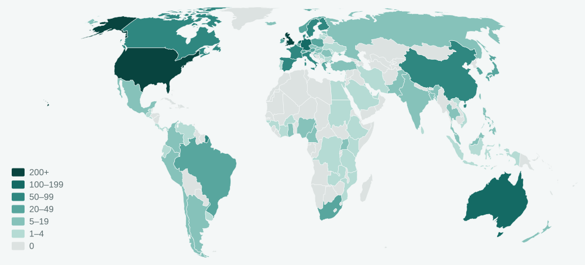

# COHO Ontology Documentation

[//]: # "This file is meant to be edited by the ontology maintainer."

Welcome to the COHO documentation!

You can find descriptions of the standard ontology engineering workflows [here](workflows/index.md).
